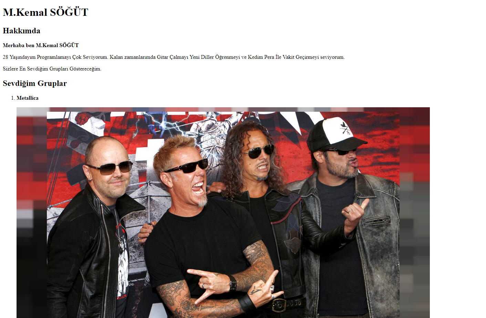

# Kodluyoruz-FrontEnd-ilkWebsite
We Code In Front-End Education "Hakan Yalçınkaya" Our first web page we created with HTML as a presentation of the homework given to us by our teacher.



## Installation

Clone the Project;

```bash
git clone https://github.com/KemaList93/Kodluyoruz-FrontEnd-ilkWebsite.git
```

## Usage

After cloning the project, open it in Visual Studio Code.

 For the Linux;
```linux
cd Kodluyoruz-FrontEnd-ilkWebsite
code .
```

## Contributing
Pull requests are accepted. For major changes, please open a thread to discuss what you want to change first.

